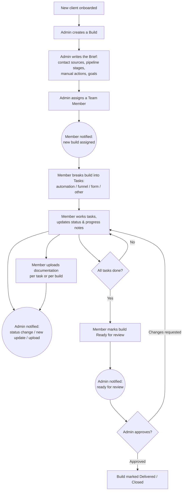
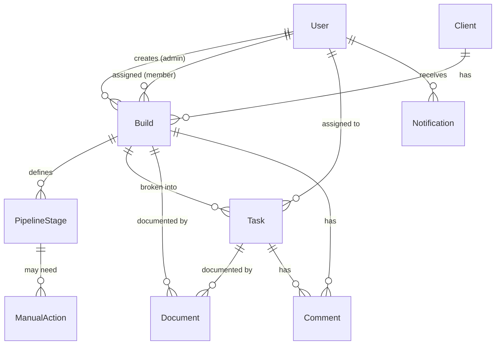

# Calari Solutions — Internal Client Delivery System

**Plan & technical spec** · Stack: Next.js + Prisma + PostgreSQL · Scale: 1–5 team, <10 clients/mo

---

## 1. What this system does

When Calari onboards a new client, **Clare (boss/admin)** captures the *broader picture* of what the client needs — where contacts come in (website, ads), how they should flow through the pipeline stages, and any manual actions required. She then **delegates** that build to a **team member**, who does the actual work (automations, funnels, forms), reports progress, and uploads documentation. Everyone gets **notified** when a task is assigned or updated.

In short: a lightweight internal **brief → delegate → build → document** tool, purpose-built for an automation agency.

---

## 2. Roles & permissions

| Role | Who | Can do |
|------|-----|--------|
| **Admin** | Clare (boss) | Create clients & builds, write the brief (sources, pipeline stages, manual actions), assign/reassign team members, see everything, comment, approve/close builds |
| **Member** | Team (1–5) | See builds assigned to them, work the tasks, update status, log progress notes, upload documentation, comment |

Keep it to these two roles for now. Avoid finer-grained permissions until the team grows — at this scale it's overhead.

---

## 3. The core workflow



### How the "broader picture" is structured

The Brief is the heart of the admin's input. It has four parts:

1. **Contact sources** — where leads enter (Website form, Facebook/IG ads, Google ads, manual import, etc.). Free-text + tags.
2. **Pipeline stages** — the ordered flow a contact moves through (e.g. *New Lead → Contacted → Qualified → Booked → Won*). Each stage has a name, description, and a flag for whether a **manual action** is needed.
3. **Manual actions** — anything a human must do at a stage (e.g. "Sales rep calls within 1 hr", "Send contract manually"). Linked to a stage.
4. **Goals / notes** — the outcome the client wants, integrations involved (GHL, Zapier, etc.), and any constraints.

The member then translates the brief into concrete **Tasks**.

---

## 4. Data model (Prisma)



```prisma
// schema.prisma

generator client {
  provider = "prisma-client-js"
}

datasource db {
  provider = "postgresql"
  url      = env("DATABASE_URL")
}

enum Role {
  ADMIN
  MEMBER
}

enum BuildStatus {
  DRAFT             // admin still writing the brief
  ASSIGNED          // handed to a member
  IN_PROGRESS
  READY_FOR_REVIEW
  CHANGES_REQUESTED
  DELIVERED
}

enum TaskType {
  AUTOMATION
  FUNNEL
  FORM
  INTEGRATION
  OTHER
}

enum TaskStatus {
  TODO
  IN_PROGRESS
  BLOCKED
  DONE
}

enum ContactSourceType {
  WEBSITE
  ADS
  MANUAL
  OTHER
}

model User {
  id             String         @id @default(cuid())
  name           String
  email          String         @unique
  role           Role           @default(MEMBER)
  passwordHash   String?        // or omit if using OAuth/magic link
  createdBuilds  Build[]        @relation("BuildCreator")
  assignedBuilds Build[]        @relation("BuildAssignee")
  assignedTasks  Task[]
  notifications  Notification[]
  comments       Comment[]
  uploads        Document[]
  createdAt      DateTime       @default(now())
}

model Client {
  id        String   @id @default(cuid())
  name      String
  company   String?
  email     String?
  notes     String?
  builds    Build[]
  createdAt DateTime @default(now())
}

model Build {
  id             String          @id @default(cuid())
  title          String
  status         BuildStatus     @default(DRAFT)

  // The "broader picture" / brief
  goals          String?         // what the client wants, outcomes
  integrations   String?         // GHL, Zapier, etc. (free text or tags)

  client         Client          @relation(fields: [clientId], references: [id])
  clientId       String

  creator        User            @relation("BuildCreator", fields: [creatorId], references: [id])
  creatorId      String

  assignee       User?           @relation("BuildAssignee", fields: [assigneeId], references: [id])
  assigneeId     String?

  contactSources ContactSource[]
  stages         PipelineStage[]
  tasks          Task[]
  documents      Document[]
  comments       Comment[]

  dueDate        DateTime?
  createdAt      DateTime        @default(now())
  updatedAt      DateTime        @updatedAt
}

model ContactSource {
  id      String            @id @default(cuid())
  type    ContactSourceType
  label   String            // "Homepage contact form", "Meta lead ad"
  build   Build             @relation(fields: [buildId], references: [id], onDelete: Cascade)
  buildId String
}

model PipelineStage {
  id            String         @id @default(cuid())
  name          String         // "New Lead", "Booked", ...
  description   String?
  order         Int            // ordering in the pipeline
  needsManual   Boolean        @default(false)
  manualActions ManualAction[]
  build         Build          @relation(fields: [buildId], references: [id], onDelete: Cascade)
  buildId       String
}

model ManualAction {
  id          String        @id @default(cuid())
  description String        // "Rep calls within 1hr"
  owner       String?       // role/person responsible
  stage       PipelineStage @relation(fields: [stageId], references: [id], onDelete: Cascade)
  stageId     String
}

model Task {
  id           String     @id @default(cuid())
  title        String
  description  String?
  type         TaskType   @default(OTHER)
  status       TaskStatus @default(TODO)
  progressNote String?    // member's latest report
  build        Build      @relation(fields: [buildId], references: [id], onDelete: Cascade)
  buildId      String
  assignee     User?      @relation(fields: [assigneeId], references: [id])
  assigneeId   String?
  documents    Document[]
  comments     Comment[]
  dueDate      DateTime?
  createdAt    DateTime   @default(now())
  updatedAt    DateTime   @updatedAt
}

model Document {
  id         String   @id @default(cuid())
  filename   String
  url        String   // storage URL (S3 / UploadThing / Supabase)
  mimeType   String?
  sizeBytes  Int?
  build      Build?   @relation(fields: [buildId], references: [id], onDelete: Cascade)
  buildId    String?
  task       Task?    @relation(fields: [taskId], references: [id], onDelete: Cascade)
  taskId     String?
  uploadedBy User     @relation(fields: [uploaderId], references: [id])
  uploaderId String
  createdAt  DateTime @default(now())
}

model Comment {
  id        String   @id @default(cuid())
  body      String
  build     Build?   @relation(fields: [buildId], references: [id], onDelete: Cascade)
  buildId   String?
  task      Task?    @relation(fields: [taskId], references: [id], onDelete: Cascade)
  taskId    String?
  author    User     @relation(fields: [authorId], references: [id])
  authorId  String
  createdAt DateTime @default(now())
}

model Notification {
  id        String   @id @default(cuid())
  type      String   // BUILD_ASSIGNED, TASK_UPDATED, DOC_UPLOADED, READY_FOR_REVIEW, COMMENT
  message   String
  link      String   // deep link to the build/task
  read      Boolean  @default(false)
  user      User     @relation(fields: [userId], references: [id])
  userId    String
  createdAt DateTime @default(now())
}
```

---

## 5. Notifications

Triggered server-side whenever the relevant action happens (in a shared service function so logic isn't duplicated across routes).

| Event | Who gets notified | Channels |
|-------|-------------------|----------|
| Build assigned / reassigned | The assigned member | In-app + email |
| Task status changed / progress note added | Build's admin (Clare) | In-app + email |
| Document uploaded | Build's admin | In-app + email |
| Build marked *Ready for review* | Admin | In-app + email |
| *Changes requested* | Assigned member | In-app + email |
| New comment | The other party on that build/task | In-app (email optional) |

**Implementation:** write a `notify(userId, type, message, link)` helper that creates a `Notification` row **and** fires an email. In-app notifications surface via a bell icon (poll every ~30s, or upgrade to Server-Sent Events / a lightweight realtime service later). For email use **Resend** or **Postmark** — both are simple from Next.js server actions. Batch/digest can come later; at <10 clients/mo, instant per-event emails are fine.

---

## 6. File uploads

Don't store files in Postgres. Use object storage and keep only the URL in the `Document` table.

- **Easiest:** UploadThing — built for Next.js, handles the upload flow and storage in roughly an hour of setup.
- **Alternatives:** Supabase Storage (pairs well if you also host Postgres there) or AWS S3 + presigned URLs (most control).

Allow uploads scoped to either a **task** (e.g. a Zap export, screen recording, SOP for that automation) or the **whole build** (e.g. final handover doc). Both are supported by the `Document` model's optional `buildId` / `taskId`.

---

## 7. Tech stack & structure

| Layer | Choice | Notes |
|-------|--------|-------|
| Framework | **Next.js (App Router)** | Server Actions for mutations — minimal API boilerplate |
| ORM / DB | **Prisma + PostgreSQL** | Hosted on Supabase, Neon, or Railway |
| Auth | **Auth.js (NextAuth)** | Email magic-link or credentials; small team, keep simple |
| UI | **Tailwind + shadcn/ui** | Fast, clean internal-tool look |
| Files | **UploadThing** (or S3) | URL stored in DB |
| Email | **Resend** | Notification emails |
| Hosting | **Vercel** | Native Next.js deploy |

### Suggested routes (App Router)

```
/login
/dashboard                  → role-aware: admin sees all builds; member sees theirs
/clients                    → admin: list/create clients
/builds/new                 → admin: create build + write brief
/builds/[id]                → build detail: brief, pipeline stages, tasks, docs, comments
/builds/[id]/edit           → admin: edit brief / reassign
/builds/[id]/tasks/[taskId] → task detail: status, progress, uploads
/notifications              → notification center
/settings/team              → admin: manage users
```

---

## 8. Build roadmap (phased)

**Phase 1 — Foundation (MVP core)**
Auth + roles, Client and Build models, the Brief editor (sources, pipeline stages, manual actions), assign a member, basic build list/detail. → *Clare can create a build, write the picture, and hand it off.*

**Phase 2 — Execution**
Tasks (create, type, status, progress notes), task list on the build, member dashboard of "my builds / my tasks". → *Members can work and report.*

**Phase 3 — Documentation & comments**
File uploads (build- and task-scoped), comment threads. → *Documentation lives next to the work.*

**Phase 4 — Notifications**
In-app notification center + email on the key events in §5. → *Nobody misses an assignment or update.*

**Phase 5 — Polish**
Dashboard filters, build status board (kanban by stage), simple reporting (builds delivered, avg time-to-deliver), audit / activity log.

Phases 1–4 are the real product; Phase 5 is nice-to-have. At your scale you could have a usable MVP after Phases 1–2.

---

## 9. Decisions to confirm before building

1. **Auth method** — magic-link email vs. email + password? (Magic-link is less to maintain.)
2. **DB / file host** — Supabase gives you Postgres + storage + auth in one; worth considering to cut setup.
3. **GHL integration depth** — for now this system *describes* the GHL build. Do you later want it to read/write GHL via API (e.g. pull live pipeline data), or stay a planning / tracking layer? This affects whether to add an integration layer in Phase 5.
4. **Client visibility** — purely internal, or will clients ever log in to see progress? (Affects whether to add a third `CLIENT` role later.)
