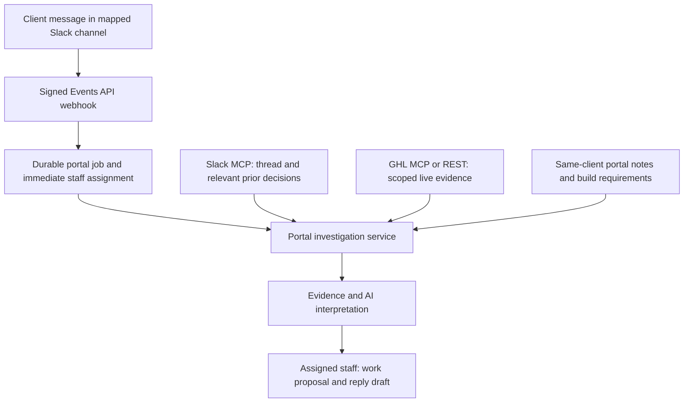

# Plan: investigate Slack requests with GHL context

Status: portal workflow implemented locally on 27 August 2026; live Slack connection and its MCP search schema verification remain the final integration step. See [implementation, coverage, tests and rollout](client-context-implementation.md). The original review below preceded implementation. No Slack posting or GHL writes were enabled.

## Decision

Keep the existing per-client encrypted token and location ID. Add MCP as a backend data-access adapter alongside the existing REST adapter. Do not restore the global MCP settings form or a separate GHL AI model selector. Calling MCP obsolete was incorrect; the old global configuration did not fit the required account boundaries.

The supplied [HighLevel setup guide](https://help.gohighlevel.com/support/solutions/articles/155000005741-how-to-setup-and-use-the-highlevel-mcp-server) describes token/location authentication, scoped discovery, and tools for CRM records and communications. Its example catalogue includes both reads and writes. Read access does not authorize sending messages or changing records.

HighLevel's [current developer documentation](https://marketplace.gohighlevel.com/docs/other/mcp/) distinguishes the original `/mcp/` endpoint from the broader `/mcp/anthropic/v2` endpoint. It now documents OAuth as well as PIT authentication, superseding the older guide's OAuth-planned FAQ. The dedicated OpenAI v2 endpoint remains listed as planned. Keep the token setup requested here; evaluate broader access separately rather than changing authentication automatically.

The [August multi-account guide](https://help.gohighlevel.com/support/solutions/articles/155000008360-highlevel-mcp-multi-account-support-for-claude) describes discovery and execution through six unified tools. Treat the published catalogue as potential capability, not proof that our token exposes any particular operation. Broader coverage does not establish access to workflow internals or execution traces.

## Intended workflow

1. Capture a message mentioning Clare in an authorized, mapped Slack channel and subsequent replies in that thread.
2. Resolve the portal client and GHL location from the channel mapping, never from the model's guess or a location named in message text.
3. Classify the request and route its original text to the configured category owners immediately. Investigation must not delay delivery to staff.
4. Gather the relevant thread and earlier authorized decisions through Slack MCP (or approved Web API reads), plus this client's build requirements, meeting notes and existing portal tasks.
5. Let AI request a small set of approved GHL reads. The backend validates each request, fetches records, filters fields and returns evidence references.
6. Produce a staff brief: what was asked, verified observations, possible causes, missing evidence, suggested work, acceptance checks and a proposed client reply.
7. Attach the brief to the existing task/thread, notify its owner without duplicate alerts, and allow staff corrections or a refresh.

Clare is not an approval step. Don receives automation/pipeline/tag work, Anita receives forms/funnels, according to configured mappings. Mixed requests produce separate responsibilities and one shared investigation, not duplicate GHL scans. Ambiguous questions still reach that channel's staff for clarification.

## Slack MCP: which direction to use

The supplied [Slack guide](https://slack.com/help/articles/48855576908307-Guide-to-Model-Context-Protocol-in-Slack) describes two different arrangements: an outside assistant using Slack's MCP server, and Slackbot using other apps' MCP servers. Its server supports search, channel/thread reads and additional actions. For Calari, use the first arrangement: the private portal requests Slack context. Do not expose Calari staff tasks or GHL credentials to a Kaizen Slackbot.

Slack's [developer overview](https://docs.slack.dev/ai/slack-mcp-server/) specifies Streamable HTTP/JSON-RPC at `https://mcp.slack.com/mcp`, a registered app, and OAuth user-token authorization. Internal or Marketplace apps are eligible; unlisted distributed apps are excluded. Normal app approval and rate limits apply. The existing bot-token connection alone is not the proposed MCP authentication.

### Proposed combined architecture

MCP supplies requested context; it does not replace the event subscription that detects incoming questions. Keep Events API ingestion for automatic capture, then call Slack MCP on demand in background jobs. Do not continuously scan the whole workspace as a substitute.

### Slack access and retrieval design

- Register or reuse an eligible, workspace-authorized internal app. Add a separate encrypted OAuth user connection for the authorized Slack reader; do not borrow a ChatGPT/Claude connector session or treat its authorization as portal access.
- Request only selected public/private search and history permissions needed for mapped channels. Exclude DM search/history, write scopes, reactions and canvas creation initially. Validate the exact requested scopes during the capability proof.
- The model may propose search terms, but the backend inserts allowed channel IDs and bounded dates, filters every result, and rejects unrelated channels. A broad user token is not broad permission to distribute its results to portal staff.
- Bind channel permissions to the client and authorized portal recipients. Confirm the workspace permits the relevant content to be copied into the private portal and processed by the chosen AI provider; technical access alone does not settle that permission.
- Retrieve the current thread first, then a small number of relevant prior decisions from explicitly mapped channels. Keep source permalinks and timestamps. Exclude unrelated personal discussions and other clients' material.
- Cache keys include workspace, user grant, channel, client and source revision. Revocation or mapping changes invalidate cached context and unfinished work. Apply retention/deletion policy to evidence, summaries and drafts, not only the original message row.
- Keep reply drafts in the portal's database. Do not use Slack send/canvas tools to store internal drafts. A future send feature must separately settle sender identity and authorization, without leaking private staff details.

This keeps the workflow private to Calari staff while respecting Kaizen's app administration and data-access rules. It does not promise an invisible integration.

## Portal features to build

| Feature | Proposed behavior |
| --- | --- |
| Client connection capabilities | Show enabled read areas, missing scopes, last check and transport. No secret preview needed. |
| Investigate this question | Staff can refresh context or provide an exact record/item reference to resolve an ambiguous match. |
| Original Slack message | Preserve the source text, sender, timestamp and permalink independently of AI output. |
| Evidence panel | Display observations with record references, retrieval time, operation used, pagination limits and access failures. |
| Suggested work | Category-specific next steps and measurable acceptance criteria; edits remain staff-controlled. |
| Proposed client reply | Editable draft using only supported facts. Copy/mark ready; no external posting initially. |
| Completion check | Reuse the same evidence service to check the exact task requirements when staff mark done. |

## Retrieval priorities

| Question area | Proposed reads, subject to confirmed operations and authorization | Result for staff |
| --- | --- | --- |
| Lead in the wrong stage | Exact contact match, opportunity details, pipeline/stage definitions, relevant fields/tags | Current state, discrepancy against agreed requirements, targeted checks for the owner |
| Missing reply or follow-up | Relevant conversation and message status; time-bounded appointment/context reads if necessary | Whether evidence shows a message was created/sent, plus what remains unknown |
| Booking problem | Relevant calendar/appointment records and applicable configuration | Identify the affected booking and compare it with intended behavior |
| Form or funnel issue | Existing form inventory plus additional supported form/funnel operations | Relevant form/page and configuration evidence; flag unavailable internals |
| Incorrect email copy | Accessible templates and this client's approved copy | Differences for the email-copy owner to review |
| Blog/social question | Approved content/status reads only when that service is in scope | Content or publication status with a suggested response |
| Payment question | Excluded initially; enable narrowly only if required and authorized | Avoid pulling financial records into routine delivery tasks |

This is not permission to enable the entire catalogue. Appointment notes, patient records, conversation bodies, submissions and payment records need a specific data-access decision. Start with configuration and synthetic contacts. “Full context” means the relevant authorized evidence, with explicit gaps, not an account-wide data dump.

## Example: Checkpilot

Fictional client message: “The new form is collecting leads, but they are not reaching the correct pipeline and the follow-up isn't arriving.”

The portal assigns Anita the form/funnel portion and Don the automation/pipeline portion. The investigation first identifies the referenced form, intended pipeline and a specific test lead. If multiple matches exist, staff supply the correct reference; the AI does not choose silently.

Suppose an authorized read confirms a test lead exists and its opportunity remains in the initial stage. That is an observation. A broken automation is still a hypothesis until configuration or execution evidence supports it. Anita receives the form-related checks; Don receives routing and follow-up checks. Neither is told a bug is fixed merely because a workflow with a matching name exists.

Example draft before a cause is established: “Thanks for flagging this. We’re checking the form-to-pipeline handoff and follow-up. Could you share one affected test submission and its approximate time so we can trace the correct record?”

After evidence is gathered, regenerate the draft using those facts. Do not include staff names, internal assignments, API details, invented fixes, promised deadlines or patient information.

## Architecture and code changes

### Shared GHL access service

Keep `projects/ghl.py` for stable, explicit REST reads. Add a bounded MCP adapter and a curated operation registry. Prove discovery and execution in a sandbox before choosing protocol details; the help article's illustrative POST is not a production transport specification.

For the original endpoint, bind both token and location on the server. For a broader endpoint, validate its actual inputs and pin the same location on every call. Never expose cross-account selection to the reasoning model.

The registry records operation ID/schema, permitted parameters, sensitivity, read/write classification and supported connection modes. AI receives narrowly named read functions. Do not grant unrestricted `execute_operation`, arbitrary URLs or arbitrary identifiers. MCP reads can use HTTP POST, so transport method alone cannot distinguish safe reads from writes. Unknown or changed operations fail closed.

Keep evidence output independent of provider. OpenAI and Claude can both interpret normalized results retrieved by the backend; provider-specific MCP features require their own compatibility test. Do not assume a Claude-specific service is interchangeable with an OpenAI endpoint.

### Slack investigation jobs

Extend `onboarding/slack_intake.py` after classification/routing with a separate durable enrichment job. Preserve the fast signed webhook and existing channel leases/deduplication. A broken MCP service must not prevent staff receiving the original request.

Proposed records:

- `ClientInvestigation`: client, channel/thread, source revision, triggering event, credential revision, state, timestamps and bounded error code.
- `InvestigationEvidence`: source type, scoped record reference, observation, timestamp, completeness and sensitivity; retain only approved fields.
- `StaffBrief`: investigation and category, evidence references, hypotheses, proposed actions, questions and draft reply.

One shared investigation can feed Don and Anita's separate briefs. Deduplicate by client/thread/source revision. Preserve staff changes; new context creates a new version or marks a draft stale. Reassignment, credential rotation, channel remapping or new thread replies must fence old in-flight results.

### Client context

Retrieve only this client's linked builds/notes/tasks. Do not reuse an unrestricted global knowledge search that can bring another client's material into the answer. General playbooks must be explicitly approved as reusable and contain no client-specific information. Fathom notes join this context only after authorized import and correct client/build mapping.

Fetch missing Slack thread context through authorized, paginated `conversations.replies`, respecting token/channel access and rate limits. The [Slack method reference](https://docs.slack.dev/reference/methods/conversations.replies/) specifies pagination and differing limits by app distribution. Record inaccessible, missing or truncated history instead of claiming the whole thread was read. Handle message edits/deletions by invalidating derived briefs and enforcing retention policy.

### UI consolidation

Extend the existing task's Slack context panel with sections for **Original**, **GHL evidence**, **Suggested work** and **Reply draft**. Keep connection configuration under Clients. Avoid a separate competing inbox or AI settings page for each integration.

Sensitive evidence endpoints must be scoped to assigned staff/managers. Do not inherit the current broad read visibility of GHL build pages for contact or conversation evidence.

## Safety and external replies

The initial release can create/update internal task context and notify staff automatically. It cannot send Slack messages, send GHL SMS/email, change pipeline records, add tags, publish content, run workflows or submit forms. Read-only tools plus server-side enforcement are required; prompt instructions alone are insufficient.

Treat Slack messages, GHL content, fetched tool descriptions and stored notes as untrusted data. Keep credentials outside prompts/logs. Bound tool calls, response sizes, context size and investigation duration. Audit requested operation, result category and evidence reference without recording secrets or full sensitive bodies.

Store drafts only inside the portal. Clare remains the authorized external contact, without needing to review internal assignment decisions. If external sending is added later, agree the sender identity, workspace authorization and staff send permission first. A bot/app may be visible to workspace administrators; this design must not attempt to conceal installation or impersonate Clare. GHL conversation sending is a different destination from a Kaizen Slack thread.

## Completion verification

Separate:

- **Observed:** a particular record/status/configuration value exists.
- **Passed check:** a defined acceptance criterion was actually tested using sufficient evidence.
- **Failed check:** evidence contradicts that criterion.
- **Needs evidence / unavailable:** necessary fields, logs, permissions or test results are missing.

MCP may supply better evidence than the current name-only inventory, but does not automatically prove a whole task works. Add checks per category only after discovering the exact operations and validating their results. End-to-end tests use a sandbox and designated test records; live workflow execution is not implicitly authorized.

## Delivery sequence and acceptance gates

1. **Capability proof:** discover the permitted catalogue with a test connection; confirm location isolation, transport, schemas, useful read operations and missing scopes. No writes or patient reads. Produce a capability matrix rather than enabling tools automatically.
2. **One-channel pilot:** authorized Slack app and separate MCP user connection, one client, configured category owners, original message + retrieved Slack context + bounded GHL evidence. Deliver originals even if enrichment fails. If MCP authorization is unavailable, expose that gap and use only permitted event/Web API context.
3. **Staff briefs and draft replies:** structured evidence citations, per-owner actions, editable drafts, missing-context questions and duplicate suppression. No Clare approval gate and no auto-send.
4. **Completion criteria:** implement a small set of objectively testable checks, then expand by evidence coverage. Retain Needs evidence for unsupported checks.
5. **Rollout:** compare representative questions with experienced staff, test provider failures and load, then expand client by client. Any write capabilities or external replies require a separate approved change.

Release tests must cover cross-client identifiers and caches, revoked tokens, malicious message instructions, unavailable scopes, pagination, stale jobs, duplicate deliveries, split ownership, staff edits, confidential draft leakage and zero outbound writes. A correct response with missing evidence is preferable to an invented confident answer.

Proposed initial budgets: at most eight GHL reads per investigation, a 45-second enrichment deadline, one concurrent investigation per client and bounded queue capacity. Cache only suitable configuration for up to five minutes; fetch time-sensitive record state fresh. Deliver the original assignment immediately, then one enrichment notification. Tune these budgets from measured pilot results, not assumed performance.

## Current state and prerequisites

Already implemented locally: encrypted per-client GHL connections, automatic business-detail onboarding, four REST inventory checks, private Slack category routing, and conservative completion review. First City Dental REST access was verified; its MCP catalogue and any expanded scopes have not been tested.

Still required: authorized portal Slack installation, event/history permissions and MCP OAuth connection, confirmed client/channel mappings, both MCP capability validations, an approved data-access/retention policy, evidence storage/ACLs, enrichment jobs and draft UI. The research Slack connector is not a portal integration. No production deployment or expanded permissions are implied by this plan.
